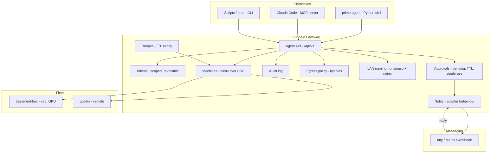
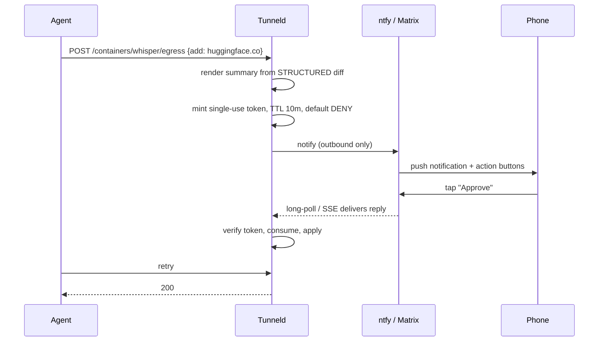

# Agent Control Plane

How Tunneld exposes its machine/container fleet to autonomous agents, and how a human stays in the loop from a phone.

## Mental Model

> A fleet of Linux boxes that an agent can treat as one machine — where every container it
> creates gets a real name on your network, a firewall it cannot escape, and an expiry date.

Tunneld is already a network control plane: it owns DNS (dnsmasq), routing and filtering
(iptables), URL routing (nginx), and — since the machines milestone — a fleet of Incus hosts
reached over SSH. The agent control plane is a thin, authenticated surface over that, plus the
two things agents need that humans do not: **enforced blast-radius limits** and **an
out-of-band way to ask permission**.

The gateway never runs the workload. It is an ARM SBC; it is the switchboard. Work happens on
enrolled machines.

## Non-Goals

- **Not multi-tenant.** Single admin, like the rest of Tunneld. One human, several agent tokens.
- **Not a GPU cloud.** Tunneld manages machines you own or rent and enroll. It does not procure.
- **Not internet-facing.** Agent-created services land on `*.tunneld.lan`. Public exposure stays
  an explicit human action.
- **Not an orchestrator.** No scheduling, no bin-packing, no HA. Containers on named machines.
- **Not harness-specific.** No MCP-shaped API, no prime-agent-shaped API. One HTTP contract,
  thin adapters.

## Architecture



## Layer 1 — The API Contract

The API is the product. Everything else is a client. Versioned, documented via OpenAPI, and the
single place authorization is decided.

| Method | Path | Scope | Notes |
|---|---|---|---|
| `GET` | `/api/v1/machines` | `machines:read` | Fleet + capabilities. **Currently unauthenticated — must be fixed.** |
| `GET` | `/api/v1/machines/:id/containers` | `machines:read` | Live over SSH. Also currently unauthenticated. |
| `POST` | `/api/v1/machines/:id/containers` | `containers:write` | Async → `202 {job_id}` |
| `POST` | `/api/v1/.../containers/:name/exec` | `exec` | **New.** Non-interactive → `{stdout, stderr, exit, duration_ms}` |
| `POST` | `/api/v1/.../containers/:name/files` | `exec` | **New.** `incus file push` |
| `GET` | `/api/v1/.../containers/:name/files?path=` | `exec` | **New.** `incus file pull` |
| `POST` | `/api/v1/.../containers/:name/expose` | `expose` | Existing `Machines.Expose` → returns `.tunneld.lan` URL |
| `POST` | `/api/v1/.../containers/:name/egress` | *approval* | Widening egress always requires a human |
| `POST` | `/api/v1/.../containers/:name/pin` | `containers:write` | Cancel TTL, promote to permanent |
| `GET` | `/api/v1/jobs/:id` | any | Poll async operations |

Scopes an agent token must **never** be able to hold: iptables rules, DNS provider, Wi-Fi/WPA,
nginx resources not owned by its own containers, machine enrollment, token issuance.

### Container lease semantics

Every agent-created container carries:

```json
{
  "owner_token": "tok_...",
  "workspace": "whisper-setup",
  "expires_at": "2026-08-06T18:22:00Z",
  "egress": ["pypi.org", "github.com"],
  "network": "bridge"
}
```

Ephemeral by default, permanent by exception. `Provider.create_container/2` currently sets
`boot.autostart true` unconditionally — for agent-created containers that must be conditional on
being pinned, or a reboot resurrects the whole graveyard.

## Layer 2 — Harness Adapters

Each adapter is a thin translation of the OpenAPI spec. None of them contain policy.

- **`tunneld-py`** — Python client. prime-agent's only tool is a persistent IPython kernel and
  its skills are Python modules with a `SKILL.md`-style reference, so a skill is a wrapper around
  this package. Also serves notebooks, scripts, anything.
- **`tunneld-mcp`** — MCP server for harnesses that speak MCP (Claude Code, editors). Build this
  *second*, after the API has been shaped by real use.
- **`tunneld` CLI** — humans, cron, CI, shell-based harnesses.

## Layer 3 — Notify & Approvals

Two distinct systems that are easy to conflate. Keep them separate.

### Notify — one-way, easy

Fire-and-forget events: job finished, TTL expiring, machine unreachable, egress denied.
An adapter behaviour mirroring the existing `Machines.Provider` dispatch pattern:

```elixir
@callback send(event :: map(), config :: map()) :: :ok | {:error, term()}
```

Implementations: `Notify.Ntfy`, `Notify.Webhook`, `Notify.Matrix`. Config lives in a JSON file
via `Tunneld.Persistence`, schema in `Tunneld.Schema`, and the settings UI comes free from the
existing JSON-schema modal renderer.

### Approvals — two-way, security-critical

A blocking gate. The agent's call returns `403 {error: "approval_required", request_id}`; the
human resolves it elsewhere; the agent retries.



**Outbound-only is the key constraint.** A home gateway may sit behind CGNAT or a router you do
not control. Do not require an inbound port or a public callback URL. Instead the gateway holds a
long-poll / SSE subscription *out* to the message channel and reads the reply from there. ntfy,
Matrix `/sync`, and Telegram `getUpdates` all support this shape.

### Approval integrity rules

1. **The summary is rendered by Tunneld from the structured request — never from agent-supplied
   free text.** A prompt-injected agent that can write its own `reason` field will write a
   benign-sounding one. What the human reads must be derived from the actual diff.
2. **Single-use, short-TTL, payload-bound tokens.** The approval authorizes one exact request,
   not "the next thing this agent asks for."
3. **Default deny on timeout.** Silence is never consent.
4. **The channel is as trusted as the admin session.** Anyone who can read the ntfy topic can
   approve. Authenticate the topic; do not use a guessable public one.
5. **Rate limit pending requests per token.** An agent that queues 200 approvals is a
   denial-of-service on your attention.
6. Every decision — approve, deny, timeout — lands in the audit log with the token that asked.

### What requires approval

- Widening a container's egress allowlist
- `macvlan` networking (makes the container a first-class device on the subnet)
- Exposing anything beyond `.tunneld.lan`
- Machine enrollment
- Exceeding a token's container or resource quota

## Security Model

The threat is **prompt injection**, not a malicious operator. The agent reads untrusted content
and holds a tool that spawns real machines on a real network with a real IP.

| Control | Enforced where | Beats |
|---|---|---|
| Scoped tokens | API layer | Agent reaching gateway config |
| Default-deny egress | iptables on gateway | Exfiltration, C2, LAN scanning |
| Bridge-only networking | `validate_spec/1` | Container impersonating a subnet device |
| Mandatory cpu/memory limits | `validate_spec/1` | Host exhaustion |
| TTL + reaper | `Tunneld.Reaper` | Abandoned-container sprawl |
| Container count quota | Token record | Fleet exhaustion |
| Unprivileged + idmap | Verified at probe | Container escape |
| Audit log | API layer | Not knowing what happened |

The egress control is the one that cannot be replicated by handing an agent an SSH key, because
it is enforced *below* the container, on the gateway, where nothing inside can reach it. It is
the strongest single argument for building this rather than not.

## New Modules

| Module | Responsibility |
|---|---|
| `Tunneld.Tokens` | Issue, scope, revoke, verify API tokens |
| `Tunneld.Audit` | Append-only log of every agent action |
| `Tunneld.Approvals` | Pending requests, TTLs, single-use tokens, default-deny |
| `Tunneld.Notify` | Dispatch behaviour + adapters (ntfy, webhook, Matrix) |
| `Tunneld.Reaper` | Expire and delete containers past TTL |
| `Tunneld.Machines.Egress` | Per-container iptables allowlist |
| `Tunneld.Machines.Files` | `incus file push` / `pull` |
| `TunneldWeb.Plugs.RequireScope` | Token + scope gate |

## Pre-Work — Fixes to Existing Code

These are needed regardless, and are load-bearing before any agent touches the API.

1. **`MachineController` `:index`, `:show`, `:containers` are not covered by `plug :require_admin`**
   (`lib/tunneld_web/controllers/machine_controller.ex:21`). The full registry — names,
   addresses, SSH ports, capabilities — is readable unauthenticated, and `:containers` triggers a
   live SSH connection unauthenticated.
2. **`Tunneld.Machines` serializes everything through one GenServer.** A 60s `create_container`
   blocks `list_containers` for the dashboard. Move long SSH operations to a
   `Task.Supervisor` with job IDs.
3. **Non-interactive exec does not exist.** `Machines.Exec` is PTY + Phoenix channel + browser
   only. `SSH.run/3` already provides the primitive.
4. **`boot.autostart true` is unconditional** (`lib/tunneld/machines/provider.ex:118`).
5. **`cpu` and `memory` are optional in `validate_spec/1`** — must be mandatory on the agent path.
6. **`macvlan` is accepted from any caller** — must be gated behind approval.

## Roadmap

**Phase 0 — Harden** *(needed anyway)*
Fix the unauthenticated GETs. De-serialize long operations. Conditional autostart.

**Phase 1 — Tokens & Audit**
`Tunneld.Tokens`, `Tunneld.Audit`, `RequireScope` plug. Token management in the settings UI.

**Phase 2 — Agent Primitives**
Non-interactive exec. File push/pull. TTL + owner + workspace on containers. Reaper.

**Phase 3 — Egress Policy**
Per-container default-deny allowlist. Denied-connection logging. This is the differentiator.

**Phase 4 — Notify & Approvals**
Notify behaviour + ntfy adapter as reference implementation. Approvals with outbound long-poll.
Approval queue in the dashboard as a fallback path.

**Phase 5 — Adapters**
OpenAPI spec → `tunneld-py` → one prime-agent skill. MCP server afterwards.

**Phase 6 — Oversight UI**
The dashboard shifts from control console to oversight console: pending approvals, TTL
countdowns, denied-egress log, per-token activity.

## Open Questions

- **Incus REST API vs. SSH.** Incus exposes an HTTPS API with client certs giving async
  operations, an events websocket, exec with separated streams and real exit codes, and file
  transfer — all things currently reconstructed by shelling `ssh` and parsing stdout. Adding
  `kind: "incus-api"` alongside the SSH provider fits the existing `Provider.dispatch/3` shape.
  Keep SSH as the zero-config enrollment path.
- **Conversational approvals.** Matrix or Telegram could support replying with text ("why do you
  need that?") rather than only approve/deny. Larger scope; revisit after Phase 4.
- **Should the reaper snapshot before deleting?** Cheap insurance against destroying something
  that turned out to matter, at the cost of storage.
- **Do agent tokens get their own machines?** A "these hosts only" restriction per token is
  simple and would let a token be scoped to disposable hardware.
