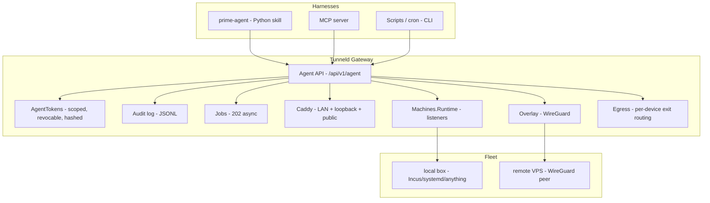

# Agent Control Plane

How Tunneld exposes its machines and resources to autonomous agents over a scoped,
authenticated HTTP API.

> The HTTP API is the product. Skills and MCP are thin adapters containing no policy.

## Mental Model

Tunneld is a network control plane: it owns DNS (dnsmasq), routing/filtering (iptables), URL
routing (Caddy), a WireGuard overlay to remote machines, and a runtime-agnostic discovery layer
(`ss -tlnp`). The agent control plane is a thin, authenticated surface over that.

The gateway never runs the workload. It is an ARM SBC — the switchboard. Work happens on
enrolled machines, discovered as listeners and exposed as resources.

## Non-Goals

- **Not multi-tenant.** Single admin, like the rest of Tunneld. One human, several agent tokens.
- **Not a GPU cloud.** Tunneld manages machines you own or rent and enroll.
- **Not harness-specific.** One HTTP contract; CLI/skill/MCP are thin adapters.

## Architecture



## The API Contract

The API is the product. Scoped bearer tokens enforce authorization; every call lands in the
audit log.

| Method | Path | Scope |
|---|---|---|
| `GET` | `/api/v1/agent/machines` | `machines:read` |
| `GET` | `/api/v1/agent/machines/:id` | `machines:read` |
| `GET` | `/api/v1/agent/machines/:id/listeners` | `machines:read` |
| `POST` | `/api/v1/agent/machines/:id/probe` | `machines:write` → 202 job |
| `POST` | `/api/v1/agent/machines/:id/exec` | `exec` → 202 job |
| `DELETE` | `/api/v1/agent/machines/:id` | `machines:write` |
| `GET` | `/api/v1/agent/resources` | `resources:read` |
| `POST` | `/api/v1/agent/resources` | `resources:write` |
| `DELETE` | `/api/v1/agent/resources/:id` | `resources:write` |
| `GET` | `/api/v1/agent/jobs/:id` | any (any valid token) |

Scopes a token must **never** be able to hold: token issuance, machine enrollment, iptables
rules outside its own resources, DNS provider config, WireGuard key material.

### Tokens

- Prefix `tnld_`, hashed at rest (only the SHA-256 is stored; the raw token is returned once).
- Revocable at any time.
- Issued only by the operator (`mix tunneld.issue_token ...`) or an admin session — never via a
  token (no privilege-escalation path).

### Jobs

Long operations (probe, exec) return `202 {job_id}` and run in a Task; poll
`GET /api/v1/agent/jobs/:id` until `status == "done"`. Results are JSON-safe.

## Harness Adapters

Each adapter is a thin translation of the HTTP API. None contain policy.

- **CLI** — `mix tunneld.agent ...` (humans, cron, CI).
- **Skill** — `skill/tunneld_agent.py` Python client (prime-agent, notebooks).
- **MCP** — `skill/tunneld_mcp.py` MCP JSON-RPC server, one tool per endpoint.

## Example

```bash
# operator issues a scoped token on the gateway
mix tunneld.issue_token machines:read,resources:write,exec

# agent lists listeners and promotes one to a resource
curl -H "Authorization: Bearer tnld_..." /api/v1/agent/machines/:id/listeners
curl -X POST -H "Authorization: Bearer tnld_..."   -d '{"name":"web","pool":["10.0.0.5:3000"]}' /api/v1/agent/resources
```
