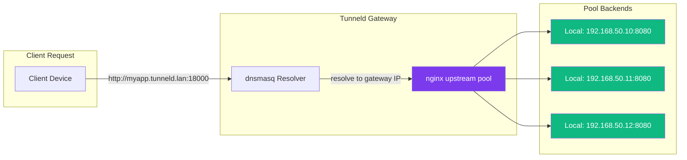
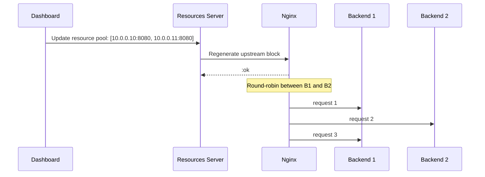

# Distributed Load Balancing

How Tunneld distributes traffic across local backends using nginx upstream pools.

## Overview

Each resource has a **pool** - a list of `ip:port` backends on the subnet
(e.g., `192.168.50.10:8080`). Nginx load balances across all pool entries for
the resource.

## How It Works

1. **Resource created** with a pool of backends (`ip:port` entries)
2. **Nginx config generated** with an `upstream` block listing all pool members,
   listening on `0.0.0.0:18000` with `server_name <name>.tunneld.lan`
3. **Health checking** - the Resources server periodically probes each backend via TCP
4. **DNS resolution** - dnsmasq resolves `<name>.tunneld.lan` to the gateway IP
5. **Traffic distributed** across all pool members (round-robin via nginx default)

## Combining Backends Across the Subnet

A single resource can front multiple backend instances of the same service
running on different subnet devices. Adding a backend to the pool is just
appending another `IP:port` entry - nginx handles the rest.

Remote backends (across the mesh/relay) are planned for a later phase; today
the pool is limited to backends reachable from the gateway itself.