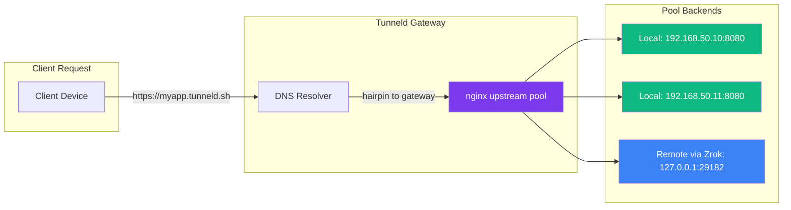
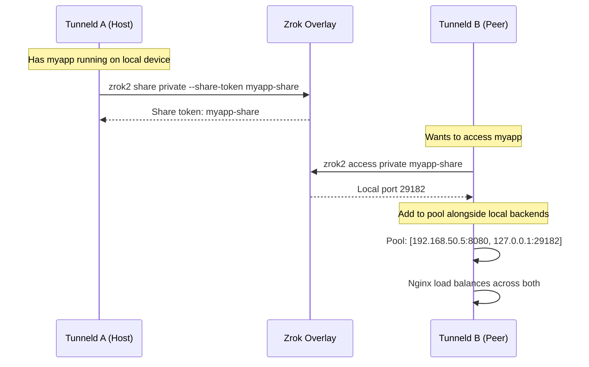

# Distributed Load Balancing

How Tunneld distributes traffic across local and remote backends using nginx upstream pools.

## Overview

Each resource has a **pool** — a list of `ip:port` backends. These can be:
- Local services on the subnet (e.g., `192.168.50.10:8080`)
- Remote services bound via Zrok access (e.g., `127.0.0.1:29182`)

Nginx load balances across all pool entries for the resource.

## How It Works

1. **Resource created** with a pool of backends (`ip:port` entries)
2. **Nginx config generated** with an `upstream` block listing all pool members
3. **Health checking** — the Resources server periodically probes each backend via TCP
4. **DNS resolution** — dnsmasq resolves `resource.tunneld.sh` to the gateway IP
5. **SSL termination** — nginx handles TLS using a per-resource cert signed by the local Root CA
6. **Traffic distributed** across healthy backends

## Combining Local + Remote

This enables distributed deployments where the same service runs on multiple Tunneld networks, and each gateway balances across all instances — both local and remote.
