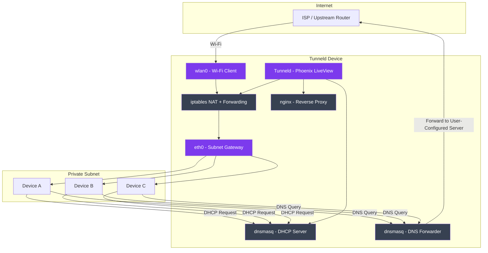

# Network Topology

How Tunneld bridges wireless upstream and wired downstream to form a private subnet.

## Data Flow

1. **Upstream**: Tunneld connects to the internet via Wi-Fi (`wlan0`)
2. **Downstream**: Devices plug into the ethernet port (`eth0`) and receive IPs via DHCP
3. **NAT**: iptables forwards traffic from eth0 through wlan0 with masquerading
4. **DNS**: All DNS queries are intercepted via iptables and routed through dnsmasq to the user-configured upstream DNS server
5. **Management**: The Phoenix LiveView dashboard controls all components
