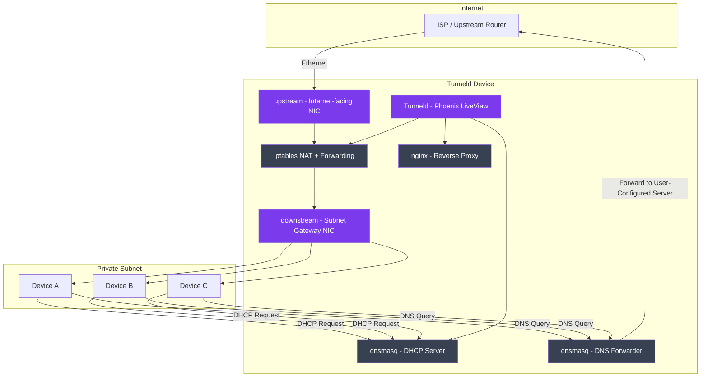

# Network Topology

How Tunneld bridges an upstream internet link and a wired downstream to form a private subnet.

## Interface Naming

Interface names come from app config (`:tunneld, :network`) and are never
hardcoded in Elixir code:

- `:upstream`   - internet-facing NIC (was `:wlan`)
- `:downstream` - subnet-facing NIC (was `:eth`)

In production these are supplied via the `UPSTREAM_INTERFACE` and
`DOWNSTREAM_INTERFACE` environment variables. In dev/test they default to
`eth0` / `eth1`.

## Data Flow

1. **Upstream**: Tunneld reaches the internet via the upstream NIC
2. **Downstream**: Devices plug into the downstream NIC and receive IPs via DHCP
3. **NAT**: iptables forwards traffic from downstream through upstream with masquerading
4. **DNS**: All DNS queries are intercepted via iptables and routed through dnsmasq to the user-configured upstream DNS server
5. **Resources**: nginx listens on `0.0.0.0:18000` and reverse-proxies `<name>.tunneld.lan` to the resource's backend pool
6. **Management**: The Phoenix LiveView dashboard controls all components