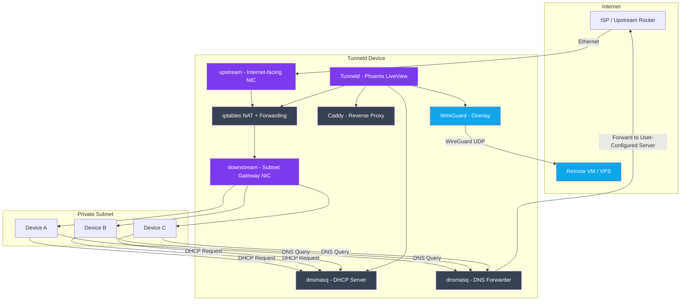

# Network Topology

How Tunneld bridges an upstream internet link and a wired downstream to form a private subnet, and how a WireGuard overlay reaches remote machines.

```mermaid
graph TB
    subgraph Internet
        ISP[ISP / Upstream Router]
        VM[Remote VM / VPS]
    end

    subgraph Tunneld Device
        UP[upstream - Internet-facing NIC]
        DOWN[downstream - Subnet Gateway NIC]
        FW[iptables NAT + Forwarding]
        DHCP[dnsmasq - DHCP Server]
        DNS[dnsmasq - DNS Forwarder]
        CADDY[Caddy - Reverse Proxy]
        WG[WireGuard - Overlay]
        APP[Tunneld - Phoenix LiveView]
    end

    subgraph Private Subnet
        D1[Device A]
        D2[Device B]
        D3[Device C]
    end

    ISP -->|Ethernet| UP
    UP --> FW
    FW --> DOWN
    DOWN --> D1
    DOWN --> D2
    DOWN --> D3
    D1 -->|DHCP Request| DHCP
    D2 -->|DHCP Request| DHCP
    D3 -->|DHCP Request| DHCP
    D1 -->|DNS Query| DNS
    D2 -->|DNS Query| DNS
    D3 -->|DNS Query| DNS
    DNS -->|Forward to User-Configured Server| ISP
    APP --> CADDY
    APP --> DHCP
    APP --> FW
    WG -->|WireGuard UDP| VM
    APP --> WG

    style UP fill:#7c3aed,color:#fff
    style DOWN fill:#7c3aed,color:#fff
    style FW fill:#374151,color:#fff
    style DHCP fill:#374151,color:#fff
    style DNS fill:#374151,color:#fff
    style CADDY fill:#374151,color:#fff
    style WG fill:#0ea5e9,color:#fff
    style VM fill:#0ea5e9,color:#fff
    style APP fill:#7c3aed,color:#fff
```

## Interface Naming

Interface names come from app config (`:tunneld, :network`) and are never
hardcoded in Elixir code:

- `:upstream`   - internet-facing NIC
- `:downstream` - subnet-facing NIC

In production these are supplied via the `UPSTREAM_INTERFACE` and
`DOWNSTREAM_INTERFACE` environment variables. In dev/test they default to
`eth0` / `eth1`.

## Data Flow

1. **Upstream**: Tunneld reaches the internet via the upstream NIC
2. **Downstream**: Devices plug into the downstream NIC and receive IPs via DHCP
3. **NAT**: iptables forwards traffic from downstream through upstream with masquerading
4. **DNS**: All DNS queries are intercepted via iptables and routed through dnsmasq to the user-configured upstream DNS server
5. **Resources**: Caddy listens on `0.0.0.0:18000` and reverse-proxies `<name>.tunneld.lan` to the resource's backend pool (plus a per-resource loopback listener on `127.0.0.1:2xxxx`)
6. **Named resolution**: dnsmasq resolves any `*.tunneld.lan` name to the gateway so resources are reachable by name across the subnet
7. **Overlay**: a WireGuard overlay (`wg-<machine_id>`, gateway dials out) makes remote machines reachable as local overlay IPs — so a service on a remote VPS is as reachable as a local one
8. **Management**: The Phoenix LiveView dashboard controls all components
