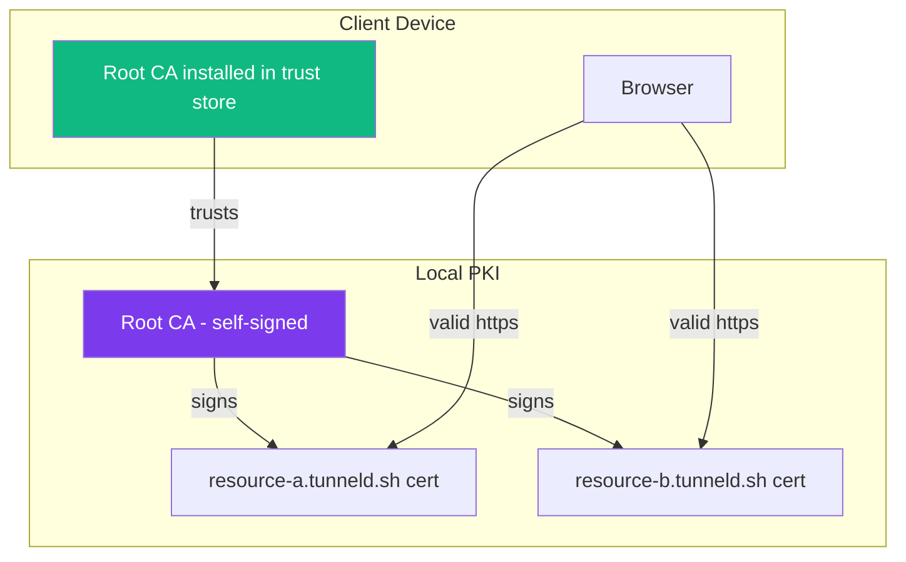
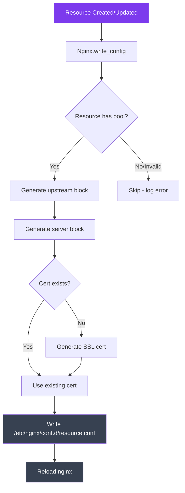

# Nginx & SSL Architecture

How Tunneld manages reverse proxy configs and SSL certificates for local resources.

## Certificate Chain



1. **CertManager** generates a Root CA on first run (`/etc/tunneld/ca/`)
2. Users download and install the Root CA on their devices via `/download/ca`
3. When a resource is created, a cert is generated for `resourcename.tunneld.sh` signed by the Root CA
4. Nginx serves the resource over HTTPS with the signed cert
5. CertManager checks cert expiry every 6 hours and regenerates if needed

## Nginx Config Generation



## Generated Config Structure

For each resource, nginx gets a config like:

```
upstream myapp {
    server 192.168.50.10:8080;
    server 192.168.50.11:8080;
}

server {
    listen 18000 ssl;
    server_name myapp.tunneld.sh;

    ssl_certificate     /etc/nginx/certs/myapp.crt;
    ssl_certificate_key /etc/nginx/certs/myapp.key;

    location / {
        proxy_pass http://myapp;
    }
}
```

Port 18000 is the shared public-facing nginx port. DNS hairpin entries point `myapp.tunneld.sh` to the gateway IP so subnet devices resolve it locally.
