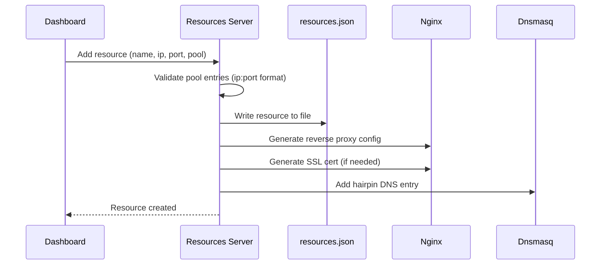
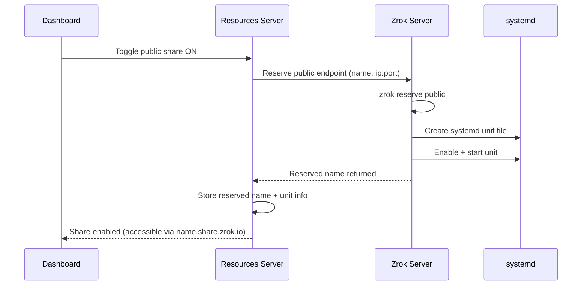
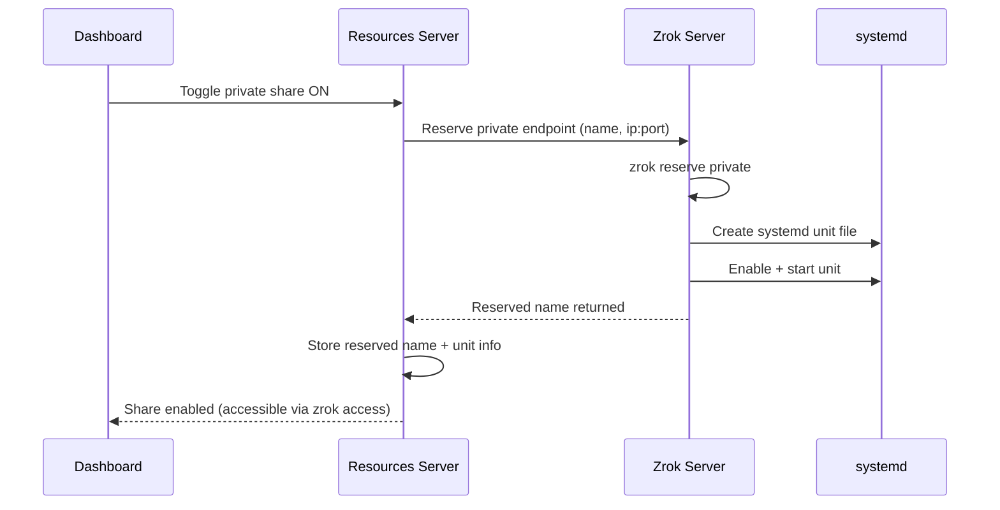
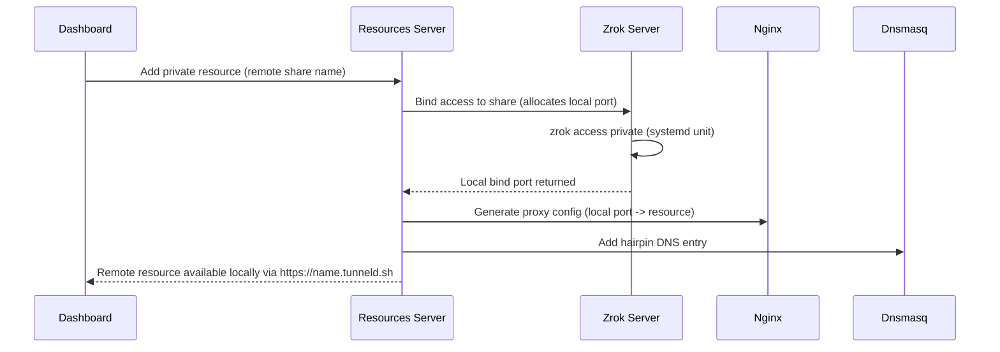

# Resource Lifecycle

How a local service goes from running on a device to being accessible publicly or privately through the overlay network.

## Creating a Resource

## Enabling a Public Share

## Enabling a Private Share

## Binding to a Remote Share (Access)

