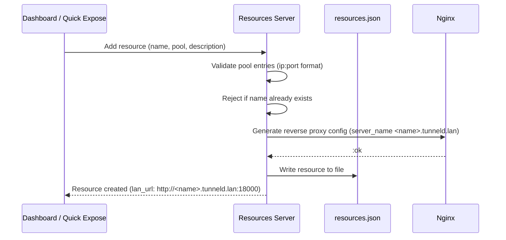
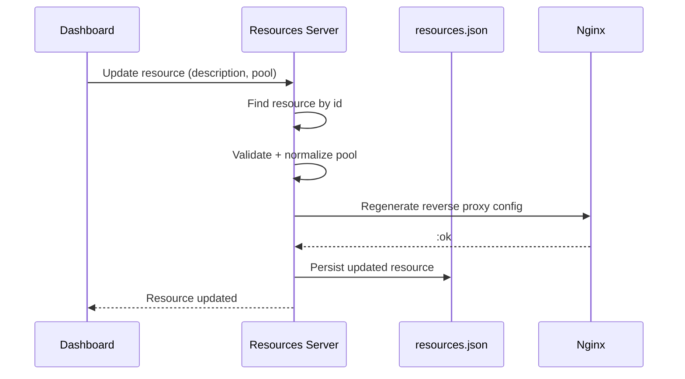
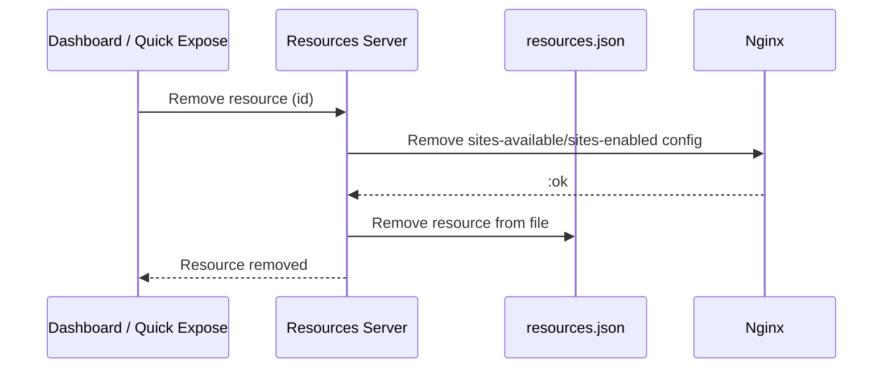

# Resource Lifecycle

How a local service on a subnet device becomes reachable from anywhere on the
subnet via a local DNS name and an nginx reverse proxy.

## Creating a Resource

A resource has:

- A **name** - used as the local DNS hostname (`<name>.tunneld.lan`)
- A **pool** - one or more `IP:port` backend entries load-balanced by nginx
- A **lan_url** - `http://<name>.tunneld.lan:18000`, reachable from any subnet
  device (dnsmasq resolves the name to the gateway IP)

There is no public-internet exposure and no per-resource auth. Access is
limited to the local subnet; relay/mesh exposure is future work.

## Updating a Resource

Only host resources can be edited. The name is immutable after creation (it is
the DNS hostname); description and pool can be changed.

## Removing a Resource

Removing a resource deletes its nginx config and the persisted entry. Backend
services themselves are untouched.

## Health Checks

The Resources server runs a 10s sync that, for each host resource, performs a
short TCP connect against each pool entry and broadcasts the result:

- `:all_up`   - every backend accepted the connection
- `:partial`  - some backends up, some down
- `:none`     - no backends reachable
- `:empty`    - pool has no entries

In mock mode (`MOCK_DATA=true`) health is simulated: all but the first entry
are reported up.