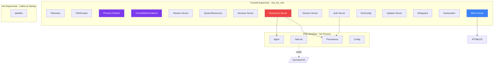
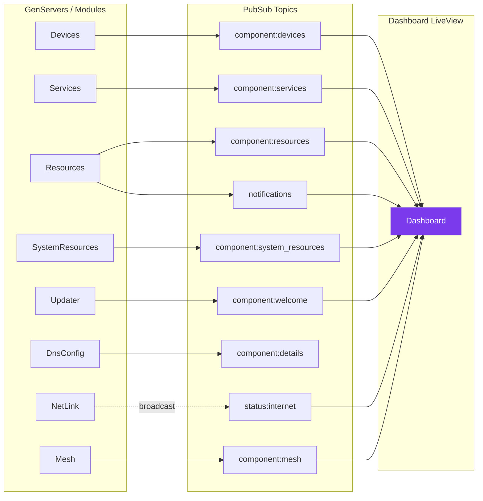

# Supervision Tree & Process Architecture

Tunneld runs as an OTP application with a flat `one_for_one` supervision tree.

## Process Map

## Polling Intervals

| Server | Interval | What It Does |
|--------|----------|--------------|
| Session | 30s | Clean expired sessions |
| Devices | 10s | Read dnsmasq leases, broadcast device list |
| Services | 10s | Check systemd service statuses |
| SystemResources | 10s | Read CPU, memory, disk via :os_mon |
| Resources | 10s | Broadcast resource list + health |
| Mesh | 25s | Poll coordinator for peers, heartbeat, and mesh sync |
| Updater | 5min | Check GitHub for new version |

Link state for the upstream/downstream interfaces is read on demand from
`/sys/class/net/<iface>/operstate` by `Tunneld.NetLink` (no GenServer, no
polling) - the dashboard LiveView queries it directly.

## PubSub Topics

The Dashboard subscribes to all topics and routes updates to child LiveComponents via `send_update/2`.