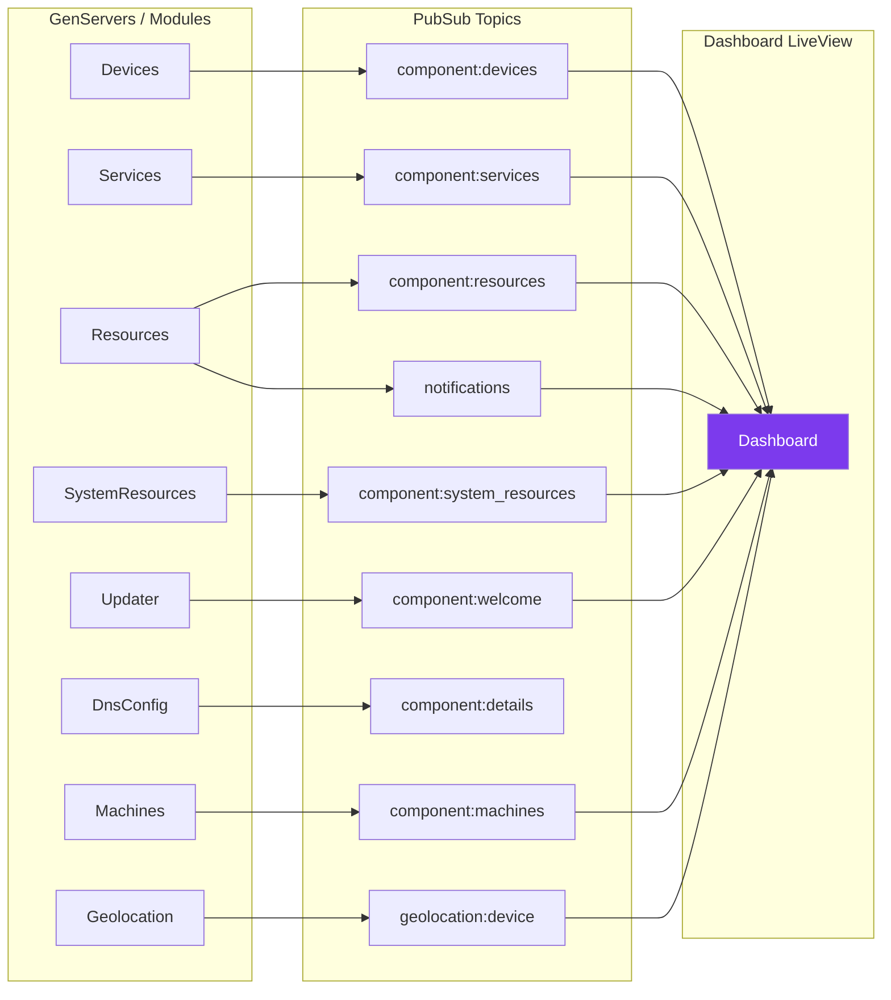

# Supervision Tree & Process Architecture

Tunneld runs as an OTP application with a flat `one_for_one` supervision tree.

## Process Map

```mermaid
graph TD
    subgraph Tunneld.Supervisor - one_for_one
        TEL[Telemetry]
        DNS_C[DNSCluster]
        PS[Phoenix.PubSub]
        EP[TunneldWeb.Endpoint]
        SESS[Session Server]
        SRES[SystemResources]
        SVC[Services Server]
        RES[Resources Server]
        DEV[Devices Server]
        AUTH[Auth Server]
        DNS_CFG[DnsConfig]
        UPD[Updater Server]
        TOK[AgentTokens]
        JOBS[Jobs]
        GEO[Geolocation]
    end

    subgraph Not Supervised - Called at Startup
        IPT[Iptables]
    end

    subgraph Plain Modules - No Process
        CADDY[Caddy]
        RUNTIME[Machines.Runtime]
        OVERLAY[Overlay]
        EGRESS[Egress]
        RECON[Reconcile]
        MACH[Machines]
        AUDIT[Audit]
        NETLINK[NetLink]
        PERSIST[Persistence]
        CFG[Config]
    end

    RES --> CADDY
    RES --> PERSIST
    AUTH --> PERSIST
    MACH --> RUNTIME
    MACH --> OVERLAY
    NETLINK -.reads.-> SYSFS[/sys/class/net/]

    style EP fill:#7c3aed,color:#fff
    style PS fill:#7c3aed,color:#fff
    style RES fill:#ef4444,color:#fff
```

`Tunneld.Machines` is a plain module, not a supervised child. Because it has no
`init/1` to recover from, `Tunneld.Application.start/2` runs
`Tunneld.Machines.recover_all/0` once in a `Task` after the tree is up - fleet
probing can take a minute per unreachable host, so it must not block boot
(`lib/tunneld/application.ex:48-52`).

## Polling Intervals

| Server | Interval | What It Does |
|--------|----------|--------------|
| Session | 30s | Clean expired sessions |
| Devices | 10s | Read dnsmasq leases, broadcast device list |
| Services | 10s | Check systemd service statuses |
| SystemResources | 10s | Read CPU, memory, disk via :os_mon |
| Resources | 10s | Broadcast resource list + health |
| Updater | 5min | Check GitHub for new version |
| Geolocation | 1h | Refresh the gateway's public-IP geolocation |
| Dashboard LiveView | 15s | Poll link state and overlay state (`@link_poll_interval` / `@overlay_poll_interval`) |

Link state for the upstream/downstream interfaces is read on demand from
`/sys/class/net/<iface>/operstate` by `Tunneld.NetLink` (no GenServer, no
polling) - the dashboard LiveView queries it directly.

## PubSub Topics

```mermaid
graph LR
    subgraph GenServers / Modules
        DEV[Devices]
        SVC[Services]
        RES[Resources]
        SR[SystemResources]
        UPD[Updater]
        DNS_CFG[DnsConfig]
        MACH[Machines]
        GEO[Geolocation]
    end

    subgraph PubSub Topics
        CD[component:devices]
        CS[component:services]
        CR[component:resources]
        CSR[component:system_resources]
        CDT[component:details]
        CW[component:welcome]
        NT[notifications]
        CM[component:machines]
        GD[geolocation:device]
    end

    subgraph Dashboard LiveView
        DLV[Dashboard]
    end

    DEV --> CD --> DLV
    SVC --> CS --> DLV
    RES --> CR --> DLV
    SR --> CSR --> DLV
    UPD --> CW --> DLV
    DNS_CFG --> CDT
    RES --> NT --> DLV
    MACH --> CM --> DLV
    GEO --> GD --> DLV

    style DLV fill:#7c3aed,color:#fff
```

The Dashboard subscribes to all topics and routes updates to child LiveComponents via `send_update/2`.

`Tunneld.NetLink` publishes nothing - it has no PubSub calls at all. Link state
is read on demand from sysfs by whoever asks (the Dashboard's own 15s poll).
